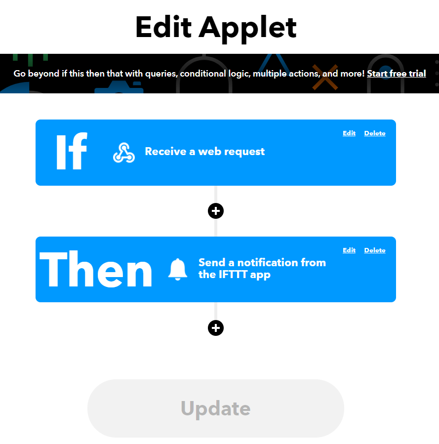

# Vitemadose Notifier

This repo contains code to fetch COVID vaccine appointment data from the vitemadose app and notify end users if there are `chronodose` appointment availabilities.

This app works by being triggered on a timer to fetch data and then sending an event to an online automation service called [IFTTT](https://ifttt.com/home).

Here are the two steps involved:
1. Configure IFTTT to react to a webhook sent back by the Google Cloud Function which will notify the phone that there are "Chronodose" doses available
2. Configure a Google Cloud Scheduler to trigger the Google Cloud Function endpoint hosting the `main.py` script

### IFTTT Webhook Notifier
The IFTTT applet is relatively simple to configure. You view the completed applet below:

1. Go to the [IFTTT](https://ifttt.com/create) website and create a new applet
<div style="text-align:center">
  
</div>

2. Create a new Webhook service for the "If" step with an event name of `vitemadose` (remember this event name as we will use it later)
<div style="text-align:center">
  
</div>

3. Create a new notification service for the "Then" step
<div style="text-align:center">
  
</div>

4. Profit! You now have a complete applet ready to go

<div style="text-align:center">
  
</div>

### Google Cloud Scheduler
In order to set up the Google Cloud Scheduler to trigger your function you will need to have you IFTTT webhook API key handy. You can find this key by visiting the [IFTTT maker webhook settings page](https://ifttt.com/maker_webhooks/settings) and then copying the text at the end of the url in the image below:

<div style="text-align:center">
  
</div>

You can then go to the [Google Cloud Scheduler page](https://console.cloud.google.com/cloudscheduler) and create a new job.

Give the job a helpful name and set the `frequency` to `* * * * *` to run trigger the cloud function every minute. You should check the [crontab guru](https://crontab.guru/) page if you want help understanding the `frequency` expression above.

You will then configure the job's target (ie: the function it should run) and data. The function we deployed is hosted at `https://us-central1-hack-space-dev.cloudfunctions.net/vitemadose-notifier-dev-ifttt-trigger` so we will use that as the URL and set the Target Type to `HTTP`. The image below shows the config we used

- Target Type: HTTP
- URL: The function we deployed is hosted at `https://us-central1-hack-space-dev.cloudfunctions.net/vitemadose-notifier-dev-ifttt-trigger` so we will use that as the URL
- HTTP Method: POST
- HTTP Headers: `Content-Type=application/json`
- Body: `{ "key": <your-ifttt-api-key>, "trigger": "vitemadose", "departement": <default: 75> }`. You can change the `"departement": "75"` key value pair to check chronodose availability for regions in France other than Paris (75)

<div style="text-align:center">
  
</div>


## Development

The script to run is `main.py`, which is deployed as a [google cloud function](https://cloud.google.com/functions/docs/quickstart-python) which responds to an HTTP trigger. We are using the [serverless framework](https://www.serverless.com/) to deploy our code using simple scripts.

To deploy this function you will need to set up a project called `hack-space-dev` (or change the `provider.project` key in the `serverless.yml` file). You will also need to install [gcloud cli](https://cloud.google.com/sdk/docs/quickstart) and [serverless framework cli](https://www.serverless.com/framework/docs/getting-started/).

You can authenticate your local machine to google cloud and ensure the `sls` cli is configured properly by following [this guide](https://www.serverless.com/framework/docs/providers/google/guide/credentials/).

You can then deploy the function using the serverless cli:
```console
sls deploy
```
